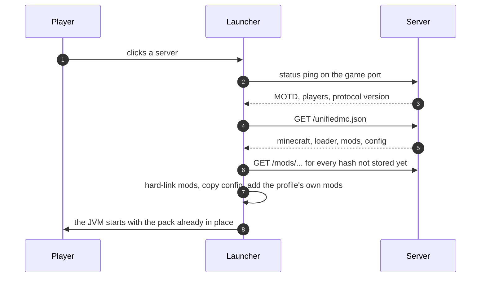
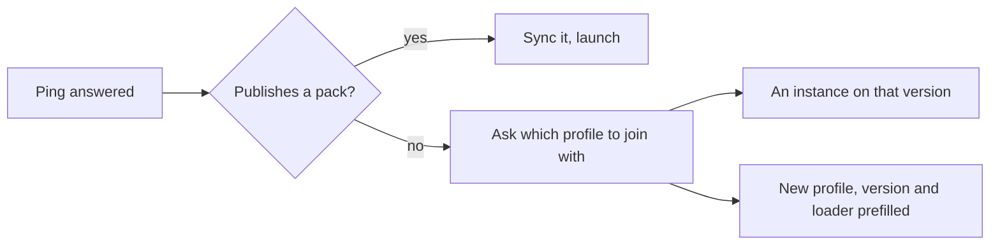

<div align="center">


# UnifiedMC

**A launcher for one modded Minecraft server and the people who play on it.**

Pick a server. The client works out which Minecraft version and mod loader it runs,
pulls the mods and configs from the server itself, and drops you into the game.

</div>

<!--
  Screenshot goes here. Drop a PNG of the running app at docs/screenshot.png
  (dark theme, the server list with one server online and its MOTD rendered),
  then uncomment the line below. Nothing else references that path.
-->
<!-- <div align="center"></div> -->

---

Nobody installs a modpack by hand, and nobody ends up on the wrong version. Built for a
private group — it is not a general-purpose launcher and does not try to be one.

## The constraint everything is shaped around

JVM mods cannot be added to a running Minecraft. Mixins apply at class load and registries
freeze during startup. "Download the mods and then join" therefore always means starting a
process that already has them — the only question is whether the player has to be the one
who arranges that. Here they do not: the arranging happens between the click and the window.

## How it works



The server is both the source of truth and the CDN — no Modrinth lookup, no guessing which
project a jar came from:

```
GET /unifiedmc.json    the manifest
GET /mods/<sha1>       a mod
GET /config/<sha1>     a config file
```

Paths in the manifest are relative, so a client resolves them against whatever address it
reached the server on. Behind a proxy or a port forward, nothing has to be configured. The
publisher lives in its own repository: [**UnifiedMC-Server**](https://github.com/EJTP/UnifiedMC-Server).

## Servers that publish nothing

Vanilla, Paper, or anything without the mod announces no pack and often no usable version
either — a proxy answers the ping with the *oldest* protocol it accepts, which pins a player
to 1.8.9 on a server that happily takes 1.21. So detection is a suggestion, not a verdict.



Every server row has a setup action: pick the Minecraft version from the full release list,
pick the loader, or leave both automatic. When the server runs no loader of its own, any
instance on the same version fits — client-side mods do not need the server to know about
them.

## What is in here

| | |
|---|---|
| `launcher/` | The desktop app. Tauri, Svelte, Rust — one binary, no Python needed. |
| `unifiedmc.py` | The original shell. Still the reference for how everything behaves. |
| `docs/` | [Reference](docs/reference.md) and the [remote-control rules](docs/remote-control.md). |
| `brand/` | The mark, and the script that renders it. |

The server mod used to live in `server/`. It is now [its own repository](https://github.com/EJTP/UnifiedMC-Server),
because it ships to a different machine, on a different schedule, to people who never run
this launcher.

## Getting started

```sh
cd launcher
pnpm install
pnpm tauri dev
```

You need Node with pnpm, a Rust toolchain, and Tauri's system dependencies. Java you do not
need: Mojang publishes a JRE per Minecraft version and the launcher fetches the right one.

Then add a server by address. It is pinged straight away; if it publishes a pack, pressing
play is the whole procedure.

Mods are stored by hash and hard-linked into each instance, so the same jar on ten servers
costs one copy. Configs are copied instead — they are meant to be edited, and a link would
write the change back into the shared store.

```
~/.unifiedmc/
  blobs/<sha1>          every mod file once, shared across servers
  mc/                   assets, libraries, versions, runtimes
  instances/<key>/      one game directory per server or profile
  profiles/<key>/mods/  mods the player added themselves
```

## Your own mods

Each server and each profile has a directory in `profiles/`. Anything dropped there is
loaded alongside what the server sends, and the server never learns about it.

The built-in browser searches Modrinth and CurseForge, filtered to the version and loader in
play, and offers only mods a single player can actually add — a mod marked
`server_side: required` needs the server to carry it too, so it is left out. What the server
already ships is marked rather than hidden.

## Settings

Memory is a slider in 512 MB steps with an automatic mode that follows the size of the pack,
capped so an explicit choice cannot push the machine into swap. The collector is a choice
between G1 tuned for short pauses, ZGC where the heap and the cores are there for it, the
JVM's own defaults, and your own flags. The exact command-line the game will get is shown
read-only underneath — it is generated by the same function that launches the game, so it
cannot drift from what actually happens.

The interface is German or English, following the system by default.

## The server-side companion

A CLI in this repository turns a modpack into a server directory and changes a running
server without SFTP, sharing the launcher's pack reader so "which side is this mod for" is
answered in one place.

```sh
cd launcher/src-tauri
cargo run --bin unifiedmc-server-cli -- init pack.mrpack
cargo run --bin unifiedmc-server-cli -- push mc.example.com:25566 sodium.jar
```

What that endpoint may and may not do is written down in [docs/remote-control.md](docs/remote-control.md);
it is off unless a token is configured.

## Signing in

Standard Microsoft authorization code flow with PKCE, scope `XboxLive.signin offline_access`,
redirecting to a loopback listener. No client secret is embedded and the authorization code
never leaves the machine.

Nothing about ownership or authentication is bypassed or weakened: the game launches with the
player's own session, and an account that does not own Minecraft cannot start it. Game files
come from Mojang's own endpoints and are never redistributed or modified.

Using the Microsoft authentication API from a third-party application requires the app to be
approved by Microsoft first. Until then the launcher runs on an offline profile, which only
reaches offline-mode servers.

## Development

```sh
cd launcher && pnpm check                              # svelte-check
cd launcher/src-tauri && cargo clippy --all-targets -- -D warnings
cd launcher/src-tauri && cargo test
./unifiedmc.py demo                                    # the shell's self-check, no network
```

Tests exist for the rules that would fail quietly: the hand-rolled ping protocol, the
CurseForge hash reimplementation, heap sizing, and which side of a pack each mod belongs to.
[CONTRIBUTING.md](CONTRIBUTING.md) says what each of them is guarding.

## How this was made

The backend is mine. Most of the rest was written with AI, across a lot of long sessions, and I
would rather say so plainly than have somebody work it out from the commit history.

It works, and it can be better. If you want to fix something, add a loader, catch a case I did
not think of, or tell me where this is wrong: issues and pull requests are both welcome.

## Licence

MIT. See [LICENSE](LICENSE).

---

NOT AN OFFICIAL MINECRAFT PRODUCT. NOT APPROVED BY OR ASSOCIATED WITH MOJANG OR MICROSOFT.
